# Plotting with BJM

BJM has plotting functions for each stage of an analysis: looking at the
data before modeling, checking the fitted sub-models, showing one
patient’s predictions, and evaluating how good the predictions are. This
article walks through all of them on the `pbc3` data. Every function
returns a `ggplot` object, so you can add layers, change themes or
labels with `+`, and save it with
[`ggplot2::ggsave()`](https://ggplot2.tidyverse.org/reference/ggsave.html).

| Stage | Function | Shows |
|----|----|----|
| Data | [`spaghettiPlot()`](https://wenhaoli18.github.io/BJM/reference/spaghettiPlot.md) | each patient’s biomarker trajectory |
| Data | [`cmtPlot()`](https://wenhaoli18.github.io/BJM/reference/cmtPlot.md) | mean trajectory of patients with the same event time |
| Data | [`cifPlot()`](https://wenhaoli18.github.io/BJM/reference/cifPlot.md) | cumulative incidence of each event type |
| Fitted models | `plot(survival_fit_all)` | hazard and odds ratios, baseline hazard |
| Fitted models | `plot(long_fit_all)` | residual and random-effect diagnostics |
| One patient | [`predictPlot()`](https://wenhaoli18.github.io/BJM/reference/predictPlot.md) | risk and biomarker as the horizon grows |
| One patient | [`riskPlot()`](https://wenhaoli18.github.io/BJM/reference/riskPlot.md) | risk as the landmark time moves |
| One patient | `plot(predictLongitudinal(...))` | predicted biomarker distribution |
| Performance | [`performancePlot()`](https://wenhaoli18.github.io/BJM/reference/performancePlot.md) | AUC and Brier score across landmarks |
| Performance | [`calibrationPlot()`](https://wenhaoli18.github.io/BJM/reference/calibrationPlot.md) | predicted versus observed risk |

``` r

library(BJM)
data(pbc3)
```

In `pbc3`, `year` is the time of each visit, `years` the follow-up time,
`status3` is 1 for death or transplantation, and `status5` codes the
event type: 0 censored, 1 death, 2 transplantation.

## Exploring the data

### Individual trajectories: `spaghettiPlot()`

One line per patient, colored here by whether the patient died
(`status2 = 1`), with a smoothed mean trajectory per group.

``` r

spaghettiPlot(pbc3, bio_variable = "serBilir", time_variable = "year",
              event_type_variable = "status2")
```

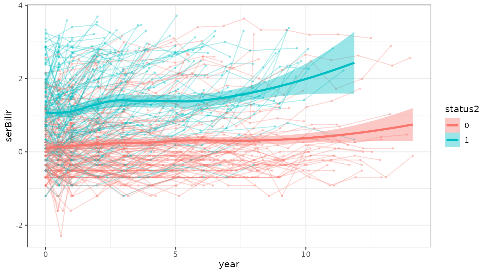

With `align = "event"`, the horizontal axis becomes the time remaining
until each patient’s event or censoring time, so 0 is the event and
every patient is lined up at their own end of follow-up. This is how the
backward joint model looks at a biomarker: as a function of time to the
event. Here bilirubin rises steeply in the years before death.

``` r

spaghettiPlot(pbc3, bio_variable = "serBilir", time_variable = "year",
              survival_variable = "years", event_type_variable = "status2",
              align = "event")
```

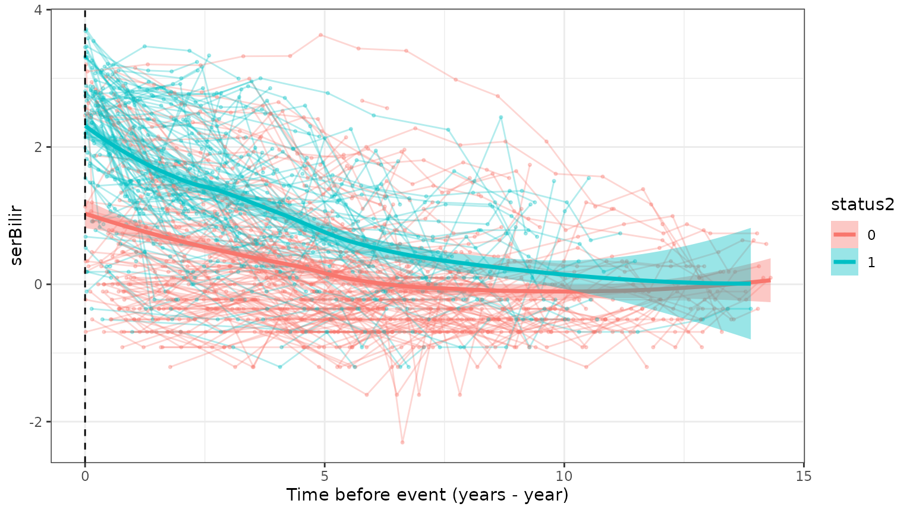

With many patients, `n_subjects` draws a random subset.

### Conditional mean trajectories: `cmtPlot()`

The mean biomarker trajectory of the patients whose event happened
around the same time (`condi_time2event`), here separately for the two
competing event types.

``` r

cmtPlot(pbc3[!is.na(pbc3$status4), ], condi_time2event = 5,
        event_type_variable = "status4", event_type = c("0", "1"),
        bio_variable = "albumin", time_variable = "year",
        survival_variable = "years", interval_time = 1 / 4)
```

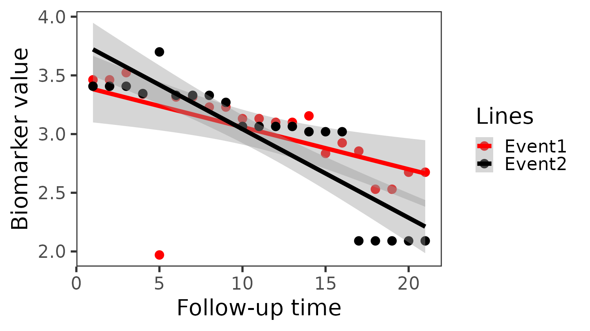

### Cumulative incidence: `cifPlot()`

The Aalen–Johansen cumulative incidence of each event type, which treats
the competing event correctly rather than as censoring. The data may be
in long format; only each patient’s first row is used.

``` r

cifPlot(pbc3, survival_variable = "years", event_type_variable = "status5",
        event_labels = c("1" = "Death", "2" = "Transplant"))
```

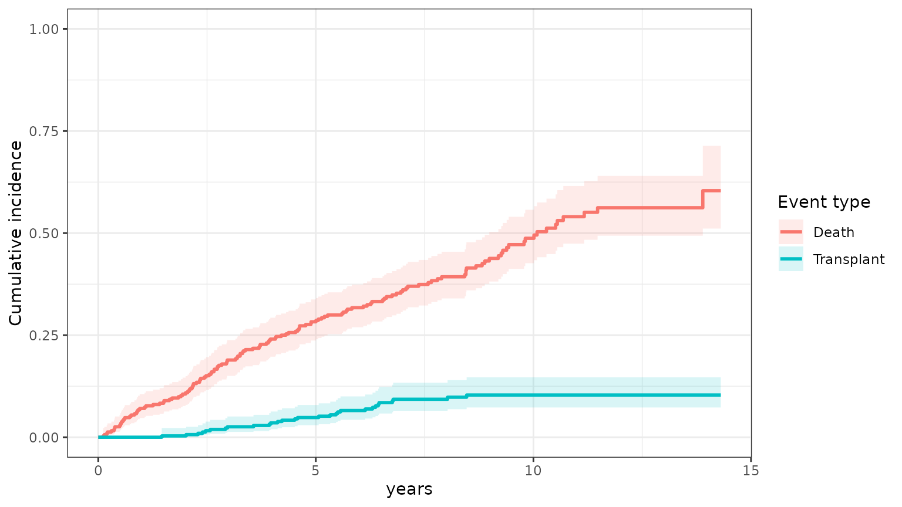

`group_variable` draws one curve per group, e.g. treatment arm:

``` r

cifPlot(pbc3, survival_variable = "years", event_type_variable = "status2",
        group_variable = "drug")
```

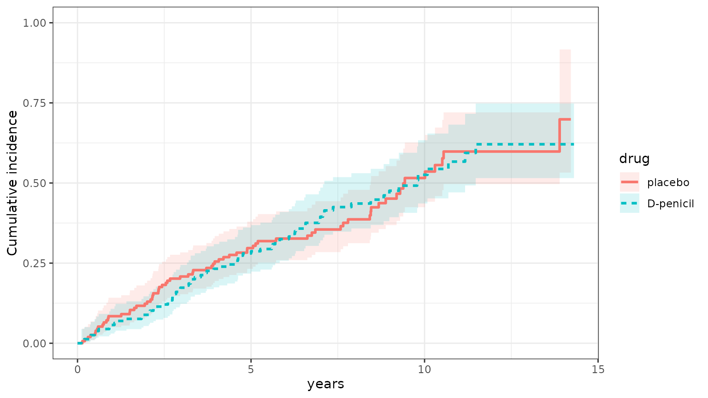

## Checking the fitted sub-models

We fit the sub-models as in
[`vignette("BJM-intro")`](https://wenhaoli18.github.io/BJM/articles/BJM-intro.md):
a Cox model for the overall event with a logistic model for the event
type, and two biomarkers.

``` r

survival_fit_all <- survivalSub(
  pbc3[!duplicated(pbc3$id), ],
  form_marginal_surv = Surv(years, status3) ~ age + sex,
  form_conditional_cr = status4 ~ years + age + sex
)

long_sub_fixed <- list(
  "serBilir" = serBilir ~ year + age + sex + years + years * year,
  "albumin"  = albumin  ~ year + age + sex + years + years * year
)
long_sub_random <- list("serBilir" = ~ year | id, "albumin" = ~ year | id)
long_fit_all <- longitudinalSub(pbc3[pbc3$status3 == 1, ], long_sub_fixed, long_sub_random)

trans <- survivalTrans(c(1, 3, 5, 7))
```

### Survival sub-model: `plot(survival_fit_all)`

A forest plot of the hazard ratios of the survival model and, with
competing risks, the odds ratios of the event-type model (here the odds
of transplantation, `status4 = 1`, versus death).

``` r

plot(survival_fit_all)
```

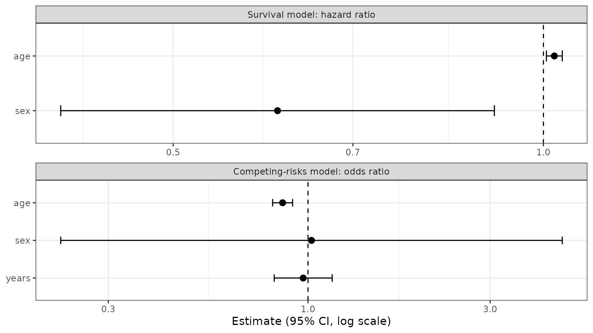

`which = "basehaz"` shows the Cox model’s baseline cumulative hazard.

``` r

plot(survival_fit_all, which = "basehaz")
```

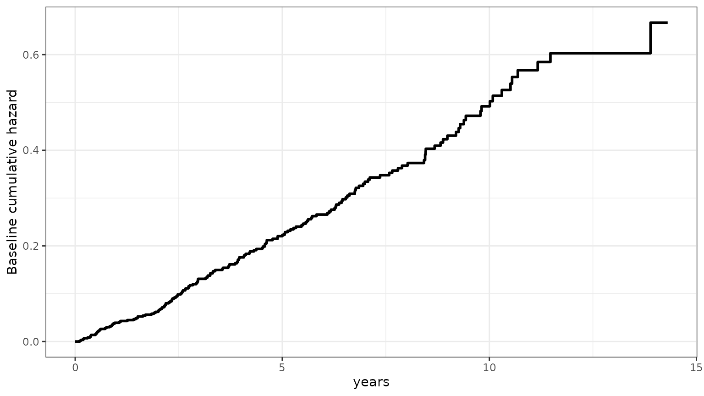

### Longitudinal sub-models: `plot(long_fit_all)`

Standardized residuals against fitted values, one panel per biomarker. A
trend in the red smoother, or a funnel shape, points to a misspecified
mean or non-constant variance.

``` r

plot(long_fit_all)
```

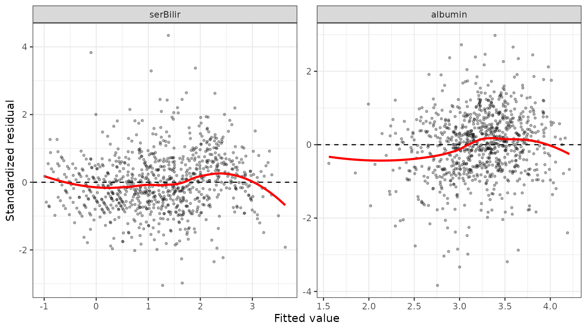

`which = "qq"` checks the residuals’ normality, and `which = "ranef"`
that of the predicted random effects.

``` r

plot(long_fit_all, which = "ranef")
```

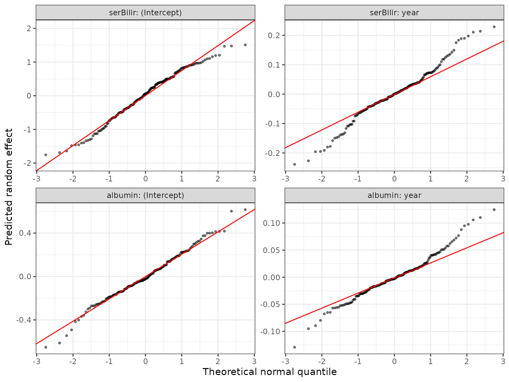

`which = "corr"` shows the correlations of the random effects across
biomarkers, estimated by the multivariate mixed model: here, patients
whose bilirubin rises faster tend to have albumin that falls faster.

``` r

plot(long_fit_all, which = "corr")
```

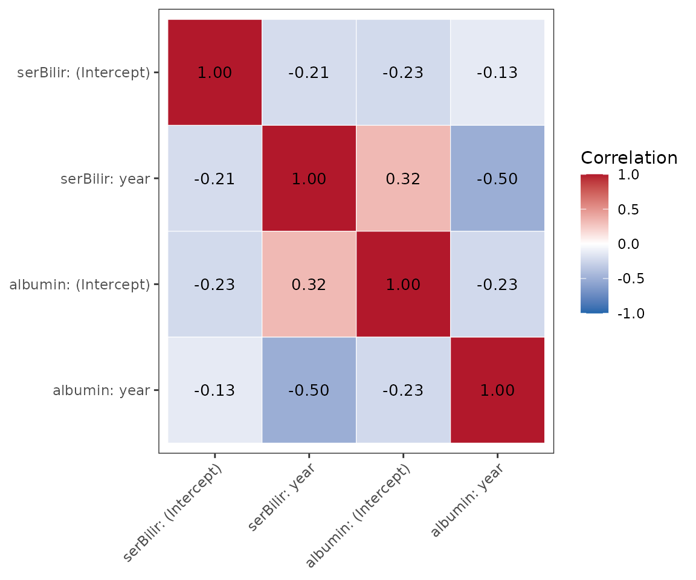

## Predictions for one patient

Patient 2’s measurements up to year 5. In a real prediction, later
measurements and the event time are not known yet.

``` r

patient <- pbc3[pbc3$id == 2 & pbc3$year <= 5, ]
patient$years <- NA
patient$status4 <- NA
```

### Risk over the prediction horizon: `predictPlot()`

The landmark is fixed at year 5 and the prediction window grows. The
plot shows the patient’s bilirubin history, the predicted risk of each
event type, and the predicted future bilirubin.

``` r

predictPlot(list(patient, patient), long_fit_all, survival_fit_all,
            prediction_time = 5, horizon = seq(0, 3, 0.5), time_variable = "year",
            trans$survival_variable_all, trans$survival_trans_function,
            bandcount1 = 10, bandcount2 = 20, bandcount3 = 50)
```

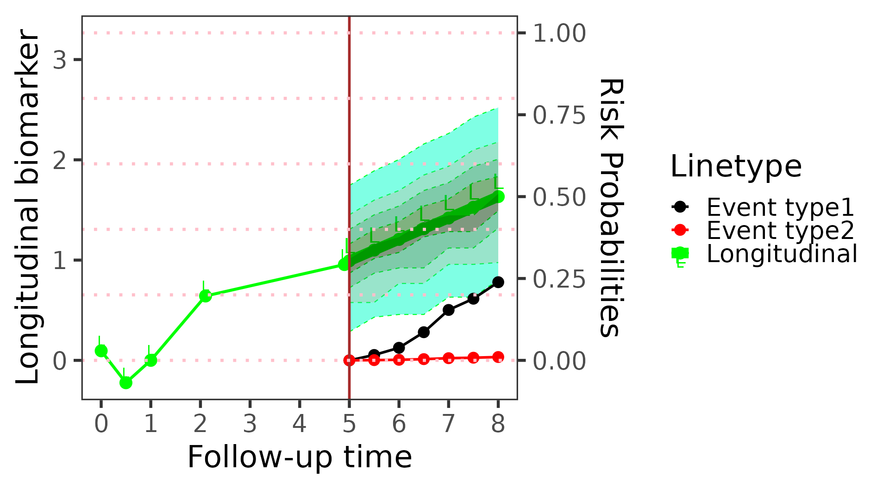

### Risk as the landmark moves: `riskPlot()`

Here the window is fixed at one year and the landmark moves, so each
point uses more of the patient’s history.

``` r

riskPlot(list(patient, patient), long_fit_all, survival_fit_all,
         prediction_time = c(1, 2, 3, 4, 5), bio_i = 1, horizon = 1,
         time_variable = "year", trans$survival_variable_all,
         trans$survival_trans_function, bandcount1 = 10, bandcount2 = 20)
```

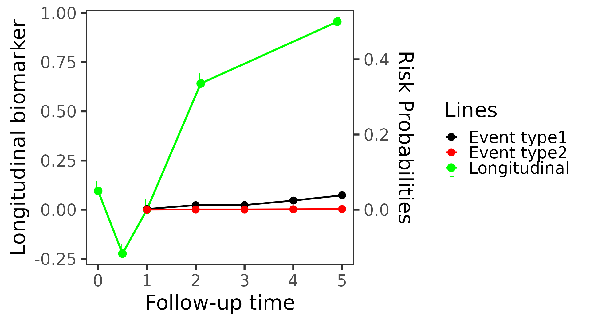

### Predicted biomarker distribution: `plot(predictLongitudinal(...))`

The predicted distribution of bilirubin one year after the landmark, for
three patients, with the most likely value marked by a dashed line.

``` r

three <- pbc3[pbc3$id %in% c(2, 4, 5) & pbc3$year <= 3, ]
three$years <- NA
three$status4 <- NA
pred <- predictLongitudinal(list(three, three), long_fit_all, survival_fit_all,
                            prediction_time = 3, horizon = 1, time_variable = "year",
                            trans$survival_variable_all, trans$survival_trans_function,
                            bio_i = 1, bandcount2 = 20, bandcount3 = 50)
plot(pred)
```

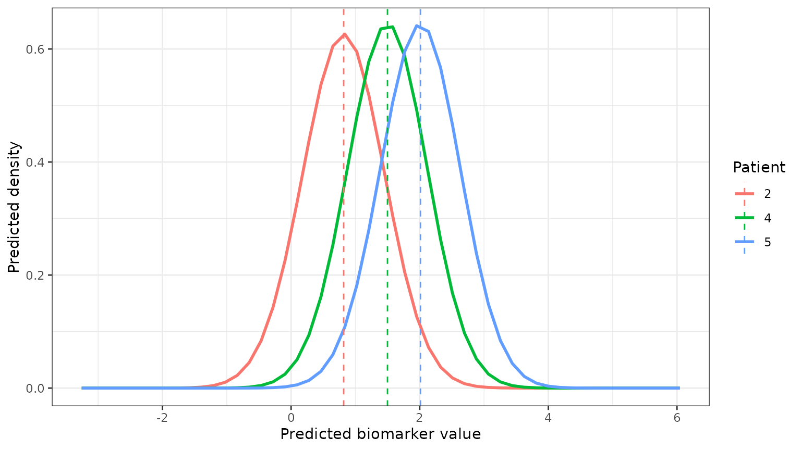

## Evaluating the predictions

Performance measured on the data the model was fit on is optimistic.
Here we split the patients at random, fit the sub-models on two thirds
of them, and evaluate on the remaining third.

``` r

set.seed(2026)
ids <- unique(pbc3$id)
train_ids <- sample(ids, round(2 / 3 * length(ids)))
train <- pbc3[pbc3$id %in% train_ids, ]
test <- pbc3[!pbc3$id %in% train_ids, ]

survival_train <- survivalSub(train[!duplicated(train$id), ],
                              Surv(years, status3) ~ age + sex,
                              status4 ~ years + age + sex)
long_train <- longitudinalSub(train[train$status3 == 1, ], long_sub_fixed, long_sub_random)
```

### Discrimination and accuracy: `performancePlot()`

At each landmark, every test patient still event-free is given a
predicted risk of an event in the next two years, from their history so
far. The time-dependent AUC measures how well these risks separate the
patients who have the event from those who do not (0.5 is chance, 1 is
perfect); the Brier score is the mean squared error of the risks (lower
is better). Censoring is handled by inverse probability of censoring
weighting.

``` r

performancePlot(test, long_train, survival_train,
                prediction_time = c(1, 2, 3, 4, 5), horizon = 2, time_variable = "year",
                trans$survival_variable_all, trans$survival_trans_function,
                bandcount1 = 20, bandcount2 = 80)
#> AUC is undefined (no cases or no event-free subjects in the window) at some landmarks; those points are left out.
```

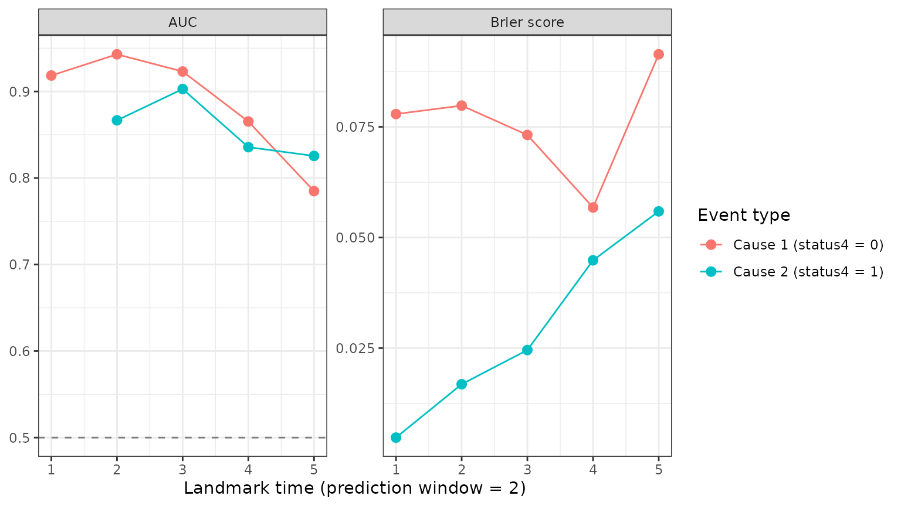

No test patient had a transplant in the two years after year 1, so the
transplant AUC is undefined there and that point is left out (the
message above). The returned plot’s `data` holds the numbers, including
how many patients were at risk and how many had each event at each
landmark.

### Calibration: `calibrationPlot()`

The AUC only checks the ranking of the risks. Calibration checks the
values: the test patients are grouped by predicted risk, and each
group’s mean predicted risk is plotted against the risk actually
observed in it. Points near the diagonal mean the predictions are
accurate; below it, the model overestimates the risk, above it, it
underestimates it.

``` r

calibrationPlot(test, long_train, survival_train,
                prediction_time = c(2, 4), horizon = 2, time_variable = "year",
                trans$survival_variable_all, trans$survival_trans_function,
                n_groups = 4, bandcount1 = 20, bandcount2 = 80)
```

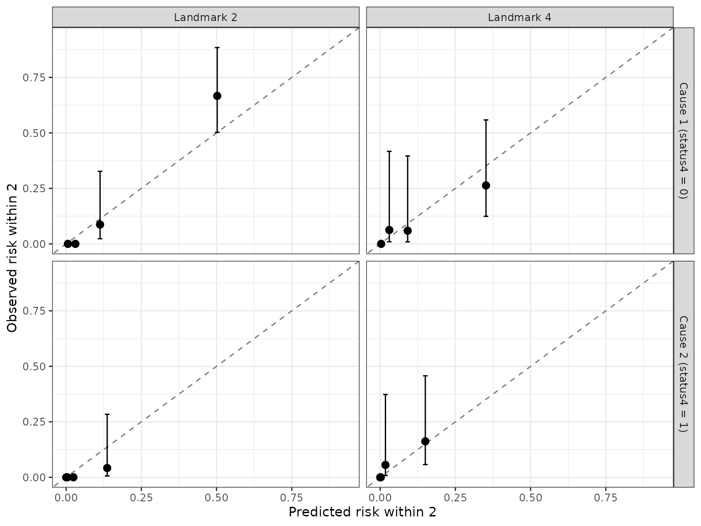

With only about a hundred test patients, and few transplants among them,
the observed risks have wide confidence intervals; use more groups with
larger data.
